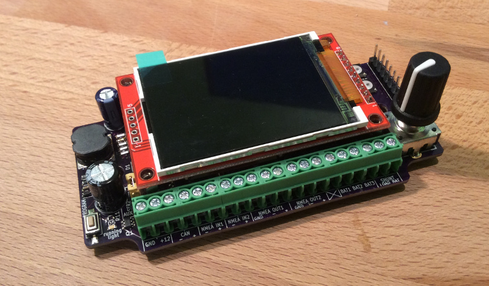

# KBox Firmware

 - [Buy KBox on
Tindie!](https://www.tindie.com/products/sarfata/kbox-open-source-boat-gateway/)

## What is KBox?

KBox connects your boat networks together and translates message from
one bus to the other. KBox also includes multiple sensors that publish
information on your boat networks. Finally KBox has a screen that can be used to
repeat some of your boat parameters.

Of course KBox is designed with the [SignalK specification](http://signalk.org)
in mind and will be compatible with it.

[KBox hardware](https://github.com/sarfata/kbox-hardware) includes:

 - One NMEA2000 interface,
 - Two NMEA0183 inputs (one of them can be used as a Seatalk input),
 - Two NMEA0183 outputs,
 - One WiFi interface that can connect to an existing network or create a new
   network on your boat,
 - Three analog inputs to measure voltages between 0 and 23V (batteries, solar
   panels, generators, etc),
 - One shunt input to measure current consumption of your main house battery,
 - One barometer,
 - One inertial measurement unit providing a magnetic compass, an accelerometer
   to measure roll, pitch and yaw as well as a gyroscope,
 - An SDCard to record data.

[KBox is an open-source hardware project](https://github.com/sarfata/kbox-hardware). You can review the
schematics and build it yourself. [You can also order a fully assembled and tested KBox from tindie.](https://www.tindie.com/products/sarfata/kbox-open-source-boat-gateway/) Every KBox sold via tindie helps support the project. Thank you!

[Find more news about KBox on
hackaday.io](https://hackaday.io/project/11055-kbox).

## How to get a KBox?

You can now [order KBox on
tindie.com](https://www.tindie.com/products/sarfata/kbox-open-source-boat-gateway/).
Supply is limited so use the "Join Waitlist" button to help me figure out how
many I need to order and build.

## What can I do with KBox?

We are still working hard on the software but we anticipate that the first and
most useful use-cases will be:

 - Relay GPS and AIS information to your mobile devices (for example, an iPad
   running [iNavX](http://inavx.com)).
 - Monitor your energy and display voltages and currents on your existing
   NMEA2000 equipment
 - Record your boat position, and all its parameters (speed over ground, speed
   over water, heeling angle, apparent and true wind, etc) to an SDCard to
   replay the race at a later point.

Because KBox is open-source, you can do a lot more things with it:

 - Use KBox as a basic NMEA2000 to USB or Network gateway (for example, for
   SignalK development)
 - Build an open-source autopilot and use KBox hardware as the main sensor and
   computer (we have extension ports to connect to the actuator)
 - etc ...

### Current software status

As of December 2017, the KBox firmware:

 - General functionality
   - Creates a new WiFi network (KBox) or can join an existing network (via simple
     code modification and recompiling)
   - Supports up to 8 simultaneous TCP clients connected on port 10110
   - Integrated web server
   - Configuration via a config file on the SDCard ([see `extras/config` for
   examples](https://github.com/sarfata/kbox-firmware/tree/master/extras/config)
 - NMEA0183
   - Forwards all NMEA0183 sentences to WiFi clients via TCP
   - Converts RMC (GPS speed and coordinates) and MWV (Wind) to SignalK
 - NMEA2000
   - Forwards all NMEA2000 messages to WiFi (even the ones not understood by
     KBox) in Seasmart format (they look like NMEA sentences and start with
     `$PCDIN`)
   - Converts PGN 127245 (Rudder), 127250 (heading), 128259 (boat speed), 128267
     (depth), 129025 (position rapid lat/lon), 129026 (sog/cog rapid) and 130306
     (wind speed and angle/direction) to SignalK
   - Generates PGN 127508 (battery), 130310 (baro pressure), 130306 (wind),
     127257 (attitude), 127250 (magnetic heading), 129026 (sog/cog rapid) from
     SignalK
 - Sensors
   - Measure nmea2000 bus voltage as well as all three battery banks voltage.
   - Measure barometric pressure
   - Measure roll, pitch and magnetic heading
   - Sensor data is available in SignalK and is automatically converted to the
     relevant NMEA and NMEA2000 messages
 - SignalK:
   - All updates generated from NMEA, NMEA2000 and internal sensors are
     available over websocket
 - Data logging
   - All NMEA and NMEA2000 messages are logged to the SDCard
 - Display
   - Battery monitor page: shows voltages of all battery
   - Stats page: shows number of received and transmitted messages on all interfaces

For more information on current work and future updates, please refer to our
[issue tracker](https://github.com/sarfata/kbox-firmware/issues).

## KBox firmware overview

KBox is based on the [Teensy 3.2](https://www.pjrc.com/teensy/) architecture and
is compatible with the Arduino development environment. The WiFi module is an
ESP8266-13 and is also programmed with an Arduino compatible SDK.

This project contains the source code for the firmware running on the host
micro-controller (teensy-like Cortex M4 micro-controller) and the firmware
running on the WiFi module.

## Building and flashing KBox

Read the [Developer setup](https://github.com/sarfata/kbox-firmware/wiki/Developer-Setup)
page of the Wiki to learn how to install and run the tools required to program KBox.

## Mailing list

Please join the [KBox-Discussion](https://groups.google.com/forum/#!topic/kbox-discussion)
mailing list! This is the best place to ask questions and discuss KBox.

## Reporting problems and Contacting the author

If you run into problems or would like to suggest new features for this project,
please use the [GitHub issue tracker](https://github.com/sarfata/kbox-firmware).

You can also find me (@sarfata) on the [SignalK Slack
server](http://slack-invite.signalk.org/).

## Contributing

Please post contributions on GitHub, in the form of pull-requests and add your
name to the list of contributors below. We kindly ask that all contributors
share their code under the MIT license. If you wish to share your code under a
different release, please make it a library and post a pull-request to include
your library.

List of contributors:

 - [Thomas Sarlandie](https://github.com/sarfata/)
 - [Neftaly Hernandez](https://github.com/neftaly)
 - [Heiko Behrens](https://github.com/HBehrens)
 - [Ronnie Zeiller](https://github.com/ronzeiller)

## License

The original code of this project is distributed under the MIT license.

Please note that most of the libraries have their own license:

 - [Adafruit Sensor](https://github.com/adafruit/Adafruit_BMP280_Library) is
 under the Apache license
 - [Adafruit BMP280](https://github.com/adafruit/Adafruit_BMP280_Library) is under the BSD license
 - [Adafruit BNO055](https://github.com/adafruit/Adafruit_BNO055/) is under the MIT license
 - [ADC library](https://github.com/pedvide/ADC) is a permissive custom license
 - [Arduino JSON](https://github.com/bblanchon/ArduinoJson) is under the MIT
   license
 - [FlexCAN](https://github.com/teachop/FlexCAN_Library) is licensed under "The
   Unlicense"
 - [i2c_t3](https://github.com/nox771/i2c_t3) is under the LGPL
 - [ILI9341_t3](https://github.com/PaulStoffregen/ILI9341_t3) is under the MIT
   license
 - [NMEA2000](https://github.com/ttlappalainen/NMEA2000/) is under the MIT
   license
 - [NMEA2000_teensy](https://github.com/sarfata/NMEA2000_teensy) is under the
   MIT license
 - [Time](https://github.com/PaulStoffregen/Time) is under the LGPL
 - [SdFat](https://github.com/greiman/SdFat) is under the MIT license
 - [ESPAsyncTCP](https://github.com/me-no-dev/ESPAsyncTCP) and
   [ESPAsyncWebServer](https://github.com/me-no-dev/ESPAsyncWebServer) are under
   the LGPL
 - The Teensy core files are distributed under the MIT license with [a specific
   clause](https://forum.pjrc.com/threads/25996-Question-about-licensing-of-core-files).
   The KBox hardware includes [a bootloader chip sold by pjrc.com](http://www.pjrc.com/store/ic_mkl02.html)
   and supports the Teensy project.

To work on KBox and program the WiFi module, you will also use
[ESPTool](https://github.com/themadinventor/esptool) which is under the GPL.

**[Fair winds and following seas](https://en.wikipedia.org/wiki/Following_sea)
to the authors of these libraries! Without them, this project would not have
been possible!**

## Changelog

 * 2018 02 10 - v1.2.0
   * Configuration option for WiFi. KBox can act as an access point and can 
   also connect to an existing network. Both are possible at the same time.
   * KBox now shows WiFi info on the screen (status as a client and as an
   access point), number of clients connected, IP address)
   * KBox now announces its SignalK "self" properly and you can set your own 
   MMSI via the config file.
   * Updated ESP8266 framework version to 2.4.
   * Fixed a bug where SDCard would not show free space properly
 * 2018 01 10
   * Fixed bug #69 - We were sending pressure in Pascal instead of Bars in NMEA
     XDR sentences for pressure.
 * 2018 01 07
   * Data coming from NMEA2000 bus is now sent to SignalK websocket output
   and will be converted to NMEA0183 (if a conversion is available).
   * Added an IMU page to show heel/roll/pitch on the screen
   * Added options to configure orientation of KBox inside the boat (still needs
     some work before it supports all possible orientations)
   * IMU calibration will be automatically saved when IMU reports its calibrated
   * User can do a long-press in the IMU page to save current offset for pitch &
     heel
 * 2018 01 04
   * Add support for parsing PGN127257 Attitude (roll/pitch/yaw)
   * Also improved the output in NMEA and SignalK format when some attitude
   values are unknown
 * 2017 12 28
   * KBox now supports a configuration file (`kbox-config.json`) on the sdcard.
   * KBox supports sending data to NMEA outputs
   * Generated NMEA sentences can be configured independently for each output
     (nmea1/nmea2/wifi)
   * Frequency of IMU and Barometer updates can be configured
   * KBox can be configured to only listen on NMEA2000 bus and not send anything
   * WiFi module can be completely disabled (will save power)
   * `tools/kbox.py` can be used to read/write files to the SDCard over USB
 * 2017 12 07
   * Merge develop branch into master - Start the changelog
   * The old master branch is not in `kbox-v0`
